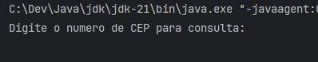
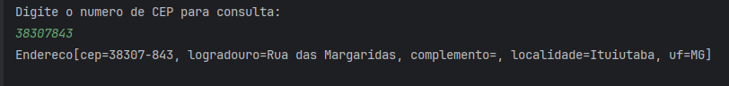

# 🔍 Buscador de CEP

Uma aplicação Java para consultar informações de endereços através de código postal (CEP) brasileiro, utilizando a API ViaCEP.

## 📋 Funcionalidades

- ✅ Busca de endereço por CEP
- ✅ Parsing automático de JSON para objetos Java
- ✅ Exportação dos dados em arquivo JSON
- ✅ Tratamento de erros e validações
- ✅ Interface de linha de comando intuitiva

## 🛠️ Tecnologias Utilizadas

| Tecnologia | Versão | Descrição |
|------------|--------|-----------|
| **Java** | 17 | Linguagem de programação principal |
| **Maven** | 4.0.0 | Gerenciador de dependências e build |
| **Gson** | 2.10.1 | Biblioteca para serialização/desserialização JSON |
| **ViaCEP API** | - | API REST para busca de dados de CEP |

## 🚀 Como Clonar e Executar

### Pré-requisitos

- **Java 17** ou superior instalado
- **Maven 3.6+** instalado
- **Git** para clonar o repositório

### Clonando o Repositório

```bash
git clone https://github.com/marcionavarro/alura-java.git
cd 01-aprenda-a-programar-em-java-com-orientacao-a-objetos/buscador
```

### Executando a Aplicação

1. **Compilar o projeto:**
```bash
mvn clean compile
```

2. **Executar a aplicação:**
```bash
mvn exec:java -Dexec.mainClass="src.Principal"
```

Ou, se preferir usar a linha de comando tradicional:

```bash
javac src/*.java
java -cp ".:target/classes:target/dependency/*" src.Principal
```

### Como Usar

1. Execute a aplicação
2. Digite um CEP válido (ex: 01001000)
3. A aplicação exibirá as informações do endereço
4. Os dados serão salvos em um arquivo JSON

**Exemplo de entrada:**
```
Digite o numero de CEP para consulta:
01001000
```

**Exemplo de saída:**
```
Endereco(cep=01001-000, logradouro=Avenida Paulista, complemento=lado ímpar, localidade=São Paulo, uf=SP)
```

## 📦 Estrutura do Projeto

```
buscador/
├── src/
│   ├── Principal.java           # Classe principal com menu interativo
│   ├── ConsultaCep.java         # Classe para consulta à API ViaCEP
│   ├── Endereco.java            # Record com dados do endereço
│   └── GeradorDeArquivo.java    # Classe para exportar dados em JSON
├── pom.xml                       # Configuração Maven
├── README.md                     # Este arquivo
└── 01001-000.json               # Exemplo de arquivo gerado
```

## 📖 Detalhes das Classes

### `Principal.java`
Casa principal da aplicação que gerencia a entrada do usuário e coordena as outras classes.

### `ConsultaCep.java`
Responsável por fazer a requisição HTTP à API ViaCEP e converter a resposta JSON para um objeto `Endereco`.

### `Endereco.java`
Record que representa a estrutura de dados de um endereço com campos: CEP, logradouro, complemento, localidade e UF.

### `GeradorDeArquivo.java`
Gerencia a exportação dos dados de endereço para arquivos JSON.

## 🖼️ Screenshots

### Execução da Aplicação

- A tela inicial e prompt de entrada



- Exemplo de resultado bem-sucedido



## 🔗 API Utilizada

[ViaCEP - API de CEP](https://viacep.com.br/)

A API ViaCEP fornece informações sobre endereços brasileiros de forma gratuita e sem necessidade de autenticação.

## 📝 Exemplo de Resposta da API

```json
{
  "cep": "01001-000",
  "logradouro": "Avenida Paulista",
  "complemento": "lado ímpar",
  "localidade": "São Paulo",
  "uf": "SP",
  "ibge": "3550308",
  "gia": "",
  "ddd": "11",
  "siafi": "7107"
}
```

## 🐛 Tratamento de Erros

- Valida se o CEP informado é válido
- Captura exceções de conexão e IO
- Exibe mensagens claras ao usuário em caso de erro


## 👨‍💻 Autor

[ Marcio Navarro ] - [marcionavarro.com.br](https://marcionavarro.com.br)

---

**Desenvolvido com ❤️ durante o aprendizado de Java**