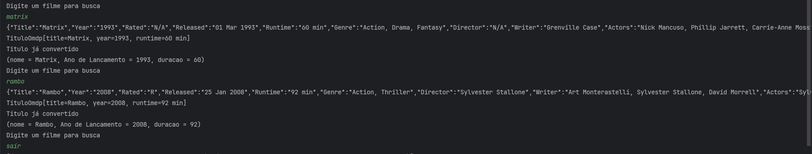

# 🎬 ScreenMatch

Uma aplicação Java orientada a objetos para gerenciar filmes e séries, com funcionalidades de avaliação, cálculo de tempo total de visualização e recomendações personalizadas.

---

## 📋 Sobre o Projeto

**ScreenMatch** é um sistema desenvolvido como parte do curso de Programação em Java com Orientação a Objetos da Alura. A aplicação permite:

- ✅ Cadastrar e gerenciar filmes e séries
- ✅ Avaliar títulos (filmes e episódios)
- ✅ Calcular tempo total de visualização
- ✅ Filtrar recomendações baseadas em classific­ações
- ✅ Integração com a API Open Movie Database (OMDB)
- ✅ Persistência de dados em JSON

---

## 🛠️ Tecnologias

<div align="left">

| Tecnologia | Versão | Descrição |
|-----------|--------|-----------|
|  | 17+ | Linguagem de programação |
|  | 2.8+ | Serialização JSON |
|  | - | Ambiente de desenvolvimento |

</div>

### Conceitos Utilizados:
- 🎯 **Programação Orientada a Objetos**: Herança, polimorfismo, encapsulamento
- 🔄 **Interfaces e Classes Abstratas**
- 📦 **Coleções (ArrayList, HashMap)**
- 🔌 **Integração com APIs REST**
- 💾 **Manipulação de arquivos JSON**
- ⚠️ **Tratamento de Exceções Customizadas**

---

## 📂 Estrutura do Projeto

```
screenmatch/
├── src/
│   └── br/com/alura/screenmatch/
│       ├── calculo/
│       │   ├── CalculadoraDeTempo.java
│       │   ├── Classificavel.java
│       │   └── FiltroRecomendacao.java
│       ├── excecao/
│       │   └── ErroDeConversaoDeAnoException.java
│       ├── modelos/
│       │   ├── Titulo.java
│       │   ├── Filme.java
│       │   ├── Serie.java
│       │   ├── Episodio.java
│       │   └── TituloOmdp.java
│       └── principal/
│           ├── Principal.java
│           ├── PrincipalComBusca.java
│           └── PrincipalComListas.java
├── filmes.json
├── filmes.txt
└── README.md
```

---

## 🚀 Como Clonar e Rodar

### Pré-requisitos

- Java JDK 17 ou superior
- Git instalado
- IDE (IntelliJ IDEA, Eclipse ou similar) - opcional

### 1️⃣ Clonar o Repositório

```bash
git clone https://github.com/marcionavarro/alura-angular.git
cd 01-aprenda-a-programar-em-java-com-orientacao-a-objetos/screenmatch
```

### 2️⃣ Abrir o Projeto

#### Com IDE (Recomendado)
- Abra a IDE
- Selecione **File → Open Project**
- Navegue até a pasta `screenmatch`
- Clique em **Open**

#### Via Terminal
```bash
# Compilar
javac -d bin src/br/com/alura/screenmatch/**/*.java

# Executar
java -cp bin br.com.alura.screenmatch.principal.Principal
```

### 3️⃣ Usar a Aplicação

A aplicação possui três pontos de entrada principais:

```bash
# Execução básica
java Principal

# Com busca de filmes (requer chave API OMDB)
java PrincipalComBusca

# Com gerenciamento de listas
java PrincipalComListas
```

---

## 📸 Screenshots


### Busca de Filmes


---

## 💡 Exemplos de Uso

### Criar um Filme

```java
Filme filme = new Filme("O Poderoso Chefão", 1970);
filme.setDuracaoEmMinutos(180);
filme.avalia(8);
filme.avalia(5);
filme.avalia(10);
System.out.println(filme.pegaMedia()); // Exibe a média de avaliações
```

### Criar uma Série

```java
Serie serie = new Serie("Lost", 2000);
serie.setTemporadas(10);
serie.setEpisodiosPorTemporada(10);
serie.setMinutosPorEpisodio(50);
System.out.println("Tempo total: " + serie.getDuracaoEmMinutos() + " minutos");
```

### Calcular Tempo Total de Visualização

```java
CalculadoraDeTempo calculadora = new CalculadoraDeTempo();
calculadora.inclui(filme);
calculadora.inclui(serie);
System.out.println(calculadora.getTempoTotal());
```

### Usar Filtro de Recomendação

```java
FiltroRecomendacao filtro = new FiltroRecomendacao();
filtro.filtra(filme); // Recomenda se classificação > 8
```

---

## 📚 Conceitos de Aprendizado

Este projeto aborda os seguintes conceitos de POO:

- **Herança**: Classes `Filme`, `Serie` e `Episodio` herdam de `Titulo`
- **Polimorfismo**: Implementação da interface `Classificavel`
- **Encapsulamento**: Uso de getters e setters
- **Tratamento de Exceções**: `ErroDeConversaoDeAnoException`
- **Collections**: Uso de `ArrayList` para gerenciar múltiplos títulos
- **Comparable**: Ordenação de títulos por nome

---

## 🎓 Referências

- [Alura - Programação em Java com Orientação a Objetos](https://www.alura.com.br)
- [Open Movie Database (OMDB) API](http://www.omdbapi.com/)
- [Documentação Java](https://docs.oracle.com/en/java/)
- [Google Gson Library](https://github.com/google/gson)

---

<div align="center">

Desenvolvido com ❤️ durante os estudos de Java e POO

</div>

