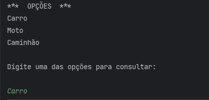
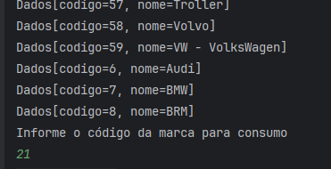
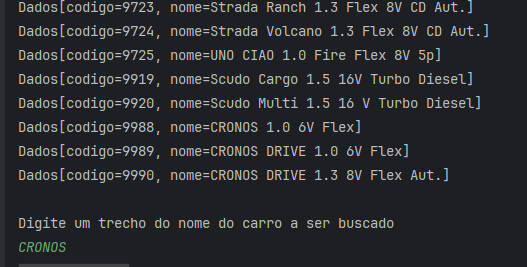
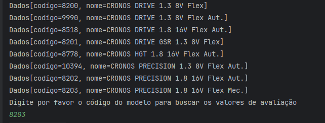
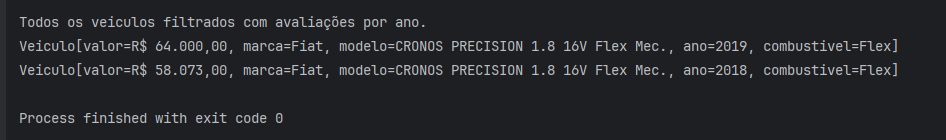

# 🚗 TabelaFip - Consultor de Preços de Veículos

Uma aplicação robusta e intuitiva para consultar a tabela FIPE de preços de veículos no Brasil. Desenvolvida em Java com Spring Boot, oferece uma experiência simples e eficiente para buscar informações de carros, motos e caminhões através de uma API pública.

---

## 📋 Sobre a Aplicação

TabelaFip é uma aplicação de linha de comando (CLI) que integra-se com a API pública de dados da tabela FIPE (Fundação Instituto de Pesquisas Econômicas). Com ela você pode:

- 🚙 Consultar marcas de carros
- 🏍️ Buscar marcas de motos  
- 🚛 Pesquisar marcas de caminhões
- 💰 Visualizar modelos e preços
- 📊 Navegar por anos e combustíveis

A aplicação realiza requisições HTTP para a API parallelum.com.br/fipe, que disponibiliza dados atualizados sobre o valor dos veículos.

---

## 🛠️ Tecnologias Utilizadas

| Tecnologia | Versão | Descrição |
|------------|--------|-----------|
| ☕ **Java** | 21 | Linguagem de programação principal |
| 🍃 **Spring Boot** | 4.0.6 | Framework para desenvolvimento de aplicações Java |
| 📦 **Maven** | 3.8+ | Gerenciador de dependências e build |
| 🔗 **Jackson Databind** | Latest | Serialização/desserialização JSON |
| 🧪 **JUnit 5** | Latest | Framework para testes unitários |
| 🌐 **HttpClient Java** | 21 | Cliente HTTP nativo para consumir APIs |

---

## 📋 Pré-requisitos

Antes de começar, certifique-se de que você possui:

- **Java 21** ou superior instalado
  ```bash
  java -version
  ```
- **Maven 3.8** ou superior instalado
  ```bash
  mvn -version
  ```
- **Git** para clonar o repositório
- Conexão com internet (para consumir a API FIPE)

---

## 🚀 Como Instalar e Rodar

### 1️⃣ Clone o Repositório

```bash
git clone https://github.com/marcionavarro/alura-java
cd TabelaFip
```

### 2️⃣ Compile o Projeto

Use o Maven para compilar e resolver todas as dependências:

```bash
mvn clean install
```

### 3️⃣ Execute a Aplicação

Para rodar a aplicação:

```bash
mvn spring-boot:run
```

Ou execute o JAR diretamente após o build:

```bash
mvn package
java -jar target/TabelaFip-0.0.1-SNAPSHOT.war
```

### 4️⃣ Interaja com o Menu

Após iniciar, a aplicação exibirá um menu interativo:

```
***  OPÇÕES  ***
Carro
Moto
Caminhão

Digite uma das opções para consultar:
```

Digite a opção desejada (carro, moto ou caminhão) e a aplicação listará todas as marcas disponíveis.

---

## 🎮 Usando a Aplicação

### Exemplo de Uso

1. Inicie a aplicação
2. Escolha uma categoria (Carro, Moto ou Caminhão)
3. A aplicação exibirá a lista de marcas ordenadas
4. Selecione a marca desejada
5. Escolha o modelo
6. Selecione o ano
7. Veja o preço atualizado do veículo

### Endpoints Consumidos

A aplicação consome os seguintes endpoints da API FIPE:

```
https://parallelum.com.br/fipe/api/v1/carros/marcas
https://parallelum.com.br/fipe/api/v1/motos/marcas
https://parallelum.com.br/fipe/api/v1/caminhoes/marcas
```

---

## 📸 Screenshots

Adicione capturas de tela da sua aplicação aqui:

  






### Estrutura de Diretórios

```
TabelaFip/
├── src/
│   ├── main/
│   │   ├── java/br/com/mn/TabelaFip/
│   │   │   ├── TabelaFipApplication.java      (Classe principal)
│   │   │   ├── model/
│   │   │   │   ├── Dados.java                 (Modelo FIPE)
│   │   │   │   ├── Modelos.java               (Modelos de veículos)
│   │   │   │   └── Veiculo.java               (Record com dados do veículo)
│   │   │   ├── principal/
│   │   │   │   └── Principal.java             (Lógica do menu CLI)
│   │   │   └── service/
│   │   │       ├── ConsumoApi.java            (Consumo da API)
│   │   │       ├── ConverteDados.java         (Conversão JSON)
│   │   │       └── IConverteDados.java        (Interface)
│   │   └── resources/
│   │       └── application.properties
│   └── test/
│       └── java/br/com/mn/TabelaFip/
├── pom.xml                                    (Configuração Maven)
├── mvnw / mvnw.cmd                            (Maven Wrapper)
└── README.md                                  (Este arquivo)
```

---

## 🔧 Desenvolvimento

### Construindo o Projeto

```bash
# Compilar
mvn clean compile

# Testes
mvn test

# Build completo
mvn clean package
```

### Principais Componentes

#### **TabelaFipApplication.java**
Classe principal que implementa `CommandLineRunner` e inicia a aplicação Spring Boot com a interface CLI.

#### **Principal.java**
Gerencia o menu interativo e a lógica de navegação através das opções de busca.

#### **ConsumoApi.java**
Responsável pelas requisições HTTP para a API FIPE usando `HttpClient` nativo do Java 21.

#### **ConverteDados.java**
Converte strings JSON em objetos Java usando Jackson Databind.

#### **Veiculo.java**
Record que representa os dados de um veículo com desserialização JSON automática.

---

## 📝 Versão

- **Versão Atual:** 0.0.1-SNAPSHOT
- **Java:** 21
- **Spring Boot:** 4.0.6
- **Maven:** 3.8+

---

## 📚 O que Aprendemos Neste Projeto

Ao desenvolver a aplicação TabelaFip, adquirimos conhecimento em diversas áreas do desenvolvimento Java:

### 🍃 **Spring Boot**
- Framework muito utilizado na comunidade Java
- Simplifica a criação de aplicações web e CLI
- Injeção de dependências e auto-configuração

### 📦 **Jackson Databind**
- Serialização e desserialização de dados JSON
- Anotações como `@JsonAlias` e `@JsonIgnoreProperties`
- Transformação automática de respostas de API em objetos Java

### 🎯 **Modelagem de Dados**
- Uso de **Records** (Java 14+) para criar modelos imutáveis
- Abstração de conceitos do domínio (Dados, Modelos, Veiculo)
- Padrão de design DTO (Data Transfer Object)

### ⚡ **Programação Funcional**
- **Streams API** para processamento de coleções
- **Funções Lambda** para lógica concisa e legível
- `sorted()`, `forEach()`, `map()`, `filter()` - operações funcionais

### 🌐 **Consumo de APIs**
- `HttpClient` Java nativo (sem dependências externas)
- Requisições HTTP GET para endpoints REST
- Tratamento de requisições síncronas e responses

### 🔌 **Integração com Serviços Externos**
- Consumo da API pública de dados FIPE
- Tratamento de erros em requisições de rede
- Processamento de grandes volumes de dados JSON

### 💻 **Interface de Linha de Comando (CLI)**
- Desenvolvimento de aplicações interativas
- Uso de `Scanner` para entrada do usuário
- Menu dinâmico e responsivo

### 📋 **Build com Maven**
- Gerenciamento de dependências
- Ciclo de vida do Maven (clean, compile, package, install)
- Profiles e configurações de build
- Maven Wrapper para portabilidade

### 🏗️ **Arquitetura e Padrões**
- Separação de responsabilidades (model, service, principal)
- Service Layer para lógica de negócio
- DAO Pattern para consumo de dados
- CommandLineRunner para inicialização de aplicações Spring

### 🧪 **Boas Práticas**
- Código limpo e legível
- Tratamento de exceções
- Records para segurança de thread
- Organização de pacotes por funcionalidade

---

## 📚 Recursos Úteis

- [Documentação Spring Boot](https://spring.io/projects/spring-boot)
- [Maven Official Guide](https://maven.apache.org/guides/)
- [Java 21 Documentation](https://docs.oracle.com/en/java/javase/21/)
- [API FIPE Parallelum](https://parallelum.com.br/fipe/api/v1/)
- [Jackson JSON Documentation](https://github.com/FasterXML/jackson)

---


## 👨‍💻 Autor

Desenvolvido como projeto de aprendizado em Java e Spring Boot pela Alura.
