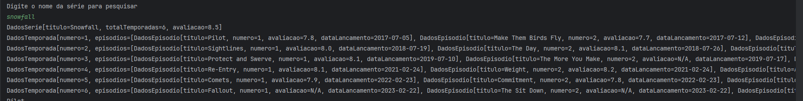
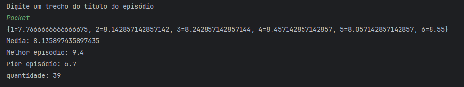

# 🚀 Screenmatch 2

Um projeto exemplo (curso Alura) em Spring Boot para manipular dados de séries e episódios, com consumo de API e conversão de dados.

---

## 🧭 Sobre a aplicação

O Screenmatch é um projeto demonstrativo que acompanha o conteúdo do curso da Alura. Ele contém modelos (`model`) para representar séries, temporadas e episódios, classes de serviço para consumo de API (`service/ConsumoApi`) e conversão de dados (`service/ConverteDados`), além de uma classe principal para execução (`principal/Principal`).

É uma aplicação Spring Boot sem camada web (aplicação de console/serviço) destinada a demonstrar conceitos de consumo de API, mapeamento de JSON e organização em camadas.

## 🛠️ Tecnologias

- Java 21 (ver `pom.xml`)
- Spring Boot 3.5.5 (starter)
- Jackson (para serialização/deserialização JSON)
- Maven (wrapper incluído: `mvnw` / `mvnw.cmd`)

## 📦 Estrutura do projeto (resumo)

- `src/main/java` - código-fonte Java
  - `br.com.mnfullstack.screenmatch.model` - modelos de dados (séries, episódios, temporadas)
  - `br.com.mnfullstack.screenmatch.service` - serviços (consumo de API, conversão)
  - `br.com.mnfullstack.screenmatch.principal` - classe `Principal` (ponto de entrada)
- `pom.xml` - configuração do Maven
- `mvnw`, `mvnw.cmd` - wrappers do Maven para Unix/Windows

## 📥 Como clonar

Abra um terminal PowerShell e execute:

```powershell
# Clonar o repositório
git clone https://github.com/marcionavarro/alura-java
# Ir para a pasta do projeto
Set-Location -Path 02-java-web-crie-aplicacoes-usando-spring-boot/screenmatch-2
```

## ▶️ Como rodar (Windows - PowerShell)

Usando o wrapper Maven (recomendado, já está no repositório):

```powershell
# Rodar diretamente com o plugin Spring Boot
.\mvnw.cmd spring-boot:run

# Ou empacotar e executar o JAR gerado
.\mvnw.cmd -DskipTests package
java -jar .\target\screenmatch-0.0.1-SNAPSHOT.jar

# Executar testes
.\mvnw.cmd test
```

Observação: se estiver em Linux/macOS, use `./mvnw` ao invés de `mvnw.cmd`.

## ✅ Notas importantes

- O `pom.xml` está configurado para Java 21 (propriedade `<java.version>21</java.version>`). Garanta que sua JDK local é compatível ou ajuste a configuração do Maven conforme necessário.
- Caso a aplicação consuma APIs externas, verifique variáveis/URLs no código ou em `application.properties` (`src/main/resources/application.properties`).


## 🖼️ Screenshots
  

