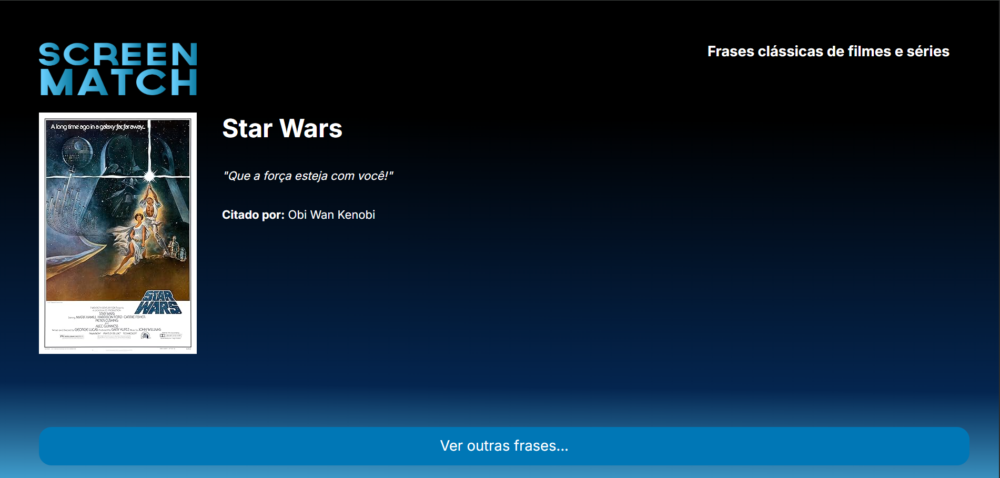

# 📺 Screenmatch Frases

✨ Uma aplicação full-stack que fornece frases aleatórias de séries de TV, desenvolvida com Spring Boot e JavaScript puro.

---

## 🎯 Descrição da Aplicação

**Screenmatch Frases** é um projeto educacional criado como parte do curso Alura de Spring Boot. A aplicação consiste em:

- **Backend**: Uma API REST robusta construída com Spring Boot que gerencia e fornece frases aleatórias de séries de TV armazenadas em um banco de dados PostgreSQL.
- **Frontend**: Uma interface moderna e intuitiva desenvolvida com HTML5, CSS3 e JavaScript vanilla que consome a API e exibe frases aleatórias.

A aplicação é perfeita para aprender sobre:
- Desenvolvimento de APIs REST com Spring Boot
- Consumo de APIs com JavaScript
- Padrões de projeto (MVC, DTO, Service)
- Integração com banco de dados PostgreSQL
- Comunicação entre frontend e backend

---

## 🛠️ Tecnologias Utilizadas

| Tecnologia | Versão | Descrição |
|:---:|:---:|:---|
| **Java** | 17 | Linguagem de programação |
| **Spring Boot** | 4.0.6 | Framework web e IoC |
| **Spring Data JPA** | 4.0.6 | ORM e persistência de dados |
| **PostgreSQL** | Latest | Banco de dados relacional |
| **Maven** | 3.x | Gerenciador de dependências |
| **HTML5** | - | Estrutura do frontend |
| **CSS3** | - | Estilização |
| **JavaScript** | ES6+ | Interatividade do frontend |

---

## 📋 Pré-requisitos e Dependências

Antes de começar, certifique-se de ter instalado:

### Requisitos Obrigatórios:
- ☕ **Java Development Kit (JDK) 17** ou superior
  - Download: [https://www.oracle.com/java/technologies/downloads/](https://www.oracle.com/java/technologies/downloads/)
  
- 🗄️ **PostgreSQL 12** ou superior
  - Download: [https://www.postgresql.org/download/](https://www.postgresql.org/download/)
  - Instale o servidor PostgreSQL e anote as credenciais de acesso

- 📦 **Maven 3.6** ou superior (incluído no Spring Boot)
  - Download: [https://maven.apache.org/download.cgi](https://maven.apache.org/download.cgi)

### Ferramentas Recomendadas:
- 🔧 **IDE**: IntelliJ IDEA, Eclipse ou VS Code com extensões Java
- 📝 **Git**: Para clonar o repositório

### Dependências do Projeto (gerenciadas automaticamente pelo Maven):
- Spring Boot Starter Web MVC
- Spring Data JPA
- PostgreSQL Driver

---

## 🚀 Como Instalar e Rodar

### Passo 1: Clonar o Repositório

```bash
# Usando HTTPS
git clone https://github.com/marcionavarro/alura-java

# Ou usando SSH
git clone git@github.com:marcionavarro/alura-java

# Entrar no diretório
cd 02-java-web-crie-aplicacoes-usando-spring-boot/screenmatch-frases
```

### Passo 2: Configurar o Banco de Dados

#### Criando o banco de dados PostgreSQL:

```sql
-- Conecte ao PostgreSQL como superusuário
psql -U postgres

-- Crie o banco de dados
CREATE DATABASE screenmatch_frases;

-- Crie um usuário (opcional, mas recomendado)
CREATE USER seu_usuario WITH PASSWORD 'sua_senha';
ALTER ROLE seu_usuario WITH CREATEDB;

-- Conceda permissões
GRANT ALL PRIVILEGES ON DATABASE screenmatch_frases TO seu_usuario;
```

#### Atualizando as configurações de conexão:

Edite o arquivo `screenmatch-frases/src/main/resources/application.properties`:

```properties
spring.datasource.url=jdbc:postgresql://localhost/screenmatch_frases
spring.datasource.username=seu_usuario
spring.datasource.password=sua_senha
spring.datasource.driver-class-name=org.postgresql.Driver
spring.jpa.hibernate.ddl-auto=update
spring.jpa.show-sql=true
```

### Passo 3: Instalar as Dependências do Backend

No diretório `screenmatch-frases/`:

```bash
# Windows
mvnw clean install

# Linux/Mac
./mvnw clean install
```

### Passo 4: Executar o Backend

```bash
# Windows
mvnw spring-boot:run

# Linux/Mac
./mvnw spring-boot:run
```

A API estará disponível em: `http://localhost:8080`

### Passo 5: Servir o Frontend

No diretório `java-desafio-front-main/`, abra o arquivo `index.html` no vscode e rode
com live server, biblioteca do vscode e configure pra rodar o live server na porta 5500:

O frontend estará disponível em: `http://localhost:5500/index.html` 

---

## 🎮 Guia de Uso da Aplicação

### Como Usar o Frontend

1. **Abra a aplicação** no navegador
2. **Clique no botão** "Obter Frase Aleatória" ou "Gerar Nova Frase"
3. **Uma frase de série** será exibida aleatoriamente
4. **Clique novamente** para obter mais frases

### Endpoints da API

#### Obter Frase Aleatória
```
GET /series/frases
```

**Resposta (200 - OK):**
```json
{
  "id": 1,
  "frase": "I'm Batman",
  "personagem": "Bruce Wayne",
  "serie": "Gotham"
}
```

**Exemplo com cURL:**
```bash
curl -X GET http://localhost:8080/series/frases
```

**Exemplo com JavaScript:**
```javascript
fetch('http://localhost:8080/series/frases')
  .then(response => response.json())
  .then(data => console.log(data))
  .catch(error => console.error('Erro:', error));
```

---

## 📸 Screenshots

### Frontend



**Nota**: Adicione screenshots reais da sua aplicação para este espaço.

---

## 📁 Estrutura de Diretórios Explicada

```
screenmatch-frases/
│
├── java-desafio-front-main/          # Frontend da aplicação
│   ├── index.html                    # Página principal (HTML5)
│   ├── style.css                     # Estilos personalizados
│   ├── scripts/
│   │   ├── index.js                  # Script de inicialização
│   │   └── getDados.js               # Comunicação com a API
│   └── img/
│       └── logo.png                  # Logo da aplicação
│
└── screenmatch-frases/               # Backend da aplicação (Spring Boot)
    ├── pom.xml                       # Configuração Maven
    ├── mvnw / mvnw.cmd               # Maven Wrapper
    │
    ├── src/
    │   ├── main/
    │   │   ├── java/br/com/mn/screenmatch_frases/
    │   │   │   ├── ScreenmatchFrasesApplication.java    # Classe principal
    │   │   │   ├── controller/
    │   │   │   │   └── FraseController.java             # Endpoints REST
    │   │   │   ├── service/
    │   │   │   │   └── FraseService.java                # Lógica de negócio
    │   │   │   ├── repository/
    │   │   │   │   └── FraseRepository.java             # Acesso a dados
    │   │   │   ├── model/
    │   │   │   │   └── Frase.java                       # Entidade JPA
    │   │   │   ├── dto/
    │   │   │   │   └── FraseDTO.java                    # Data Transfer Object
    │   │   │   └── config/
    │   │   │       └── CorsConfiguration.java           # Config de CORS
    │   │   │
    │   │   └── resources/
    │   │       ├── application.properties               # Configurações DB
    │   │       ├── static/                              # Arquivos estáticos
    │   │       └── templates/                           # Templates (se houver)
    │   │
    │   └── test/
    │       └── java/br/com/mn/screenmatch_frases/
    │           └── ScreenmatchFrasesApplicationTests.java
    │
    └── target/                       # Arquivos compilados (gerado automaticamente)
```

### Descrição dos Componentes:

| Componente | Responsabilidade |
|:---|:---|
| **Controller** | Recebe requisições HTTP e retorna respostas |
| **Service** | Implementa a lógica de negócio da aplicação |
| **Repository** | Acessa e manipula os dados no banco de dados |
| **Model** | Define a estrutura de dados (Entidade) |
| **DTO** | Transfere dados entre camadas (sem expor a entidade) |
| **Config** | Armazena configurações da aplicação |

---

## 🔧 Seção de Desenvolvimento

### Estrutura de Camadas (MVC)

A aplicação segue o padrão de camadas:

```
Request HTTP
    ↓
[Controller] - Recebe e valida
    ↓
[Service] - Processa lógica
    ↓
[Repository] - Acessa BD
    ↓
[Database PostgreSQL]
    ↓
[DTO] - Serializa resposta
    ↓
Response JSON
```

### Adicionando Novas Frases ao Banco de Dados

#### Usando SQL direto:

```sql
INSERT INTO frase (frase, personagem, serie) 
VALUES ('It''s dangerous to go alone', 'Old Man', 'The Legend of Zelda');
```

#### Usando a aplicação:

1. Crie um novo método no `FraseController` com `@PostMapping`
2. Implemente a lógica no `FraseService`
3. Use o `FraseRepository` para salvar no banco

### Criando um Novo Endpoint

Exemplo: Buscar frases por série

**1. Controller:**
```java
@GetMapping("/frases/{serie}")
public List<FraseDTO> obterFrasesPorSerie(@PathVariable String serie) {
    return service.obterFrasesPorSerie(serie);
}
```

**2. Service:**
```java
public List<FraseDTO> obterFrasesPorSerie(String serie) {
    return repository.findBySerie(serie)
        .stream()
        .map(FraseDTO::new)
        .collect(Collectors.toList());
}
```

**3. Repository:**
```java
List<Frase> findBySerie(String serie);
```