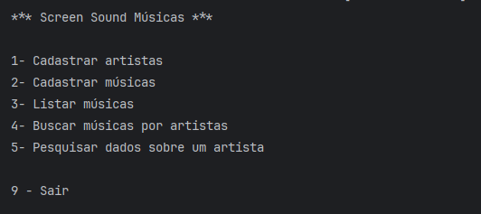
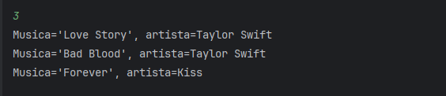
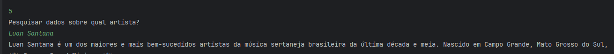

# ✨ ScreenSound

Bem-vindo ao repositório `screensound` — uma aplicação Java Spring Boot de linha de comando para gerenciar artistas e músicas, com integração opcional ao Google Gemini (via langchain4j) para pesquisar informações sobre artistas.

---

## 🎯 Descrição detalhada da aplicação

Esta é uma aplicação demonstrativa construída com Spring Boot que permite:
- Cadastrar artistas e músicas (persistidos em um banco PostgreSQL via JPA).
- Listar músicas e buscar músicas por artista.
- Consultar informações sobre um artista usando o serviço Google Gemini (via a biblioteca `langchain4j-google-ai-gemini`).

O fluxo principal é de console (CLI). Ao iniciar a aplicação, o menu interativo da classe `br.com.mn.screensound.principal.Principal` é exibido e permite interagir com as funcionalidades básicas.

---

## 🛠️ Tecnologias utilizadas

| Tecnologia | Versão / Observação |
|---|---|
| Java | 17 (propriedade `java.version` no `pom.xml`) |
| Spring Boot | 4.0.6 (parent no `pom.xml`) |
| Spring Data JPA | starter usado no `pom.xml` |
| PostgreSQL | driver em runtime (`org.postgresql:postgresql`) |
| Maven | Gerenciamento de build (`pom.xml`) |
| langchain4j Google AI Gemini | `dev.langchain4j:langchain4j-google-ai-gemini:0.35.0` |

---

## 📋 Pré-requisitos e dependências

- Java 17+ instalado e configurado no PATH
- Maven instalado (ou usar o wrapper `mvnw`/`mvnw.cmd` já presente no projeto)
- PostgreSQL rodando localmente (ou configurar outro banco e atualizar `src/main/resources/application.properties`)
- (Opcional) Conta/Chave da API do Google Gemini para utilizar o recurso de consulta de artista

Variáveis de ambiente importantes:
- `GEMINI_API_KEY` — chave da API para o serviço Gemini (usada em `ConsultaChatGemini`).

Configurações padrão (em `src/main/resources/application.properties`):
- URL: `jdbc:postgresql://localhost/screensound`
- username: `postgres`
- password: `admin`

OBS: Ajuste `spring.datasource.*` caso seu banco tenha credenciais/URL diferentes.

---

## 🚀 Como clonar, compilar e executar (passo a passo)

1) Clonar o repositório:

```powershell
git clone https://github.com/marcionavarro/alura-java
cd 02-java-web-crie-aplicacoes-usando-spring-boot/screensound
```

2) (Opcional) Definir a variável de ambiente do Gemini (apenas se for usar a funcionalidade de consulta):

```powershell
# Para a sessão atual do PowerShell
$env:GEMINI_API_KEY = 'SUA_CHAVE_AQUI'

# Para persistir (Windows):
setx GEMINI_API_KEY "SUA_CHAVE_AQUI"
```

3) Garantir que o banco PostgreSQL e o schema estão prontos. Por exemplo, no psql:

```sql
-- no psql conectado ao servidor Postgres
CREATE DATABASE screensound;
-- ou ajustar suas credenciais em src/main/resources/application.properties
```

4) Buildar o projeto (usando o wrapper para garantir compatibilidade):

```powershell
.\mvnw.cmd clean package -DskipTests
```

5) Rodar a aplicação:

```powershell
.\mvnw.cmd spring-boot:run
```

ou executar o JAR gerado:

```powershell
java -jar target\screensound-0.0.1-SNAPSHOT.jar
```

Ao iniciar, o menu da aplicação (console) será exibido. Siga as opções numéricas para cadastrar artistas, músicas, listar e pesquisar.

---

## 🎮 Guia de uso da aplicação (fluxo no console)

Após iniciar a aplicação, o menu principal exibe as opções:

1 - Cadastrar artistas
  - Informe o nome e o tipo (SOLO, DUPLA, BANDA) — o tipo é mapeado pelo enum `TipoArtista`.

2 - Cadastrar músicas
  - Informe o artista (nome). Se encontrado, informe o título da música para salvar.

3 - Listar músicas
  - Mostra todas as músicas cadastradas para todos os artistas.

4 - Buscar músicas por artista
  - Informe o nome do artista (busca parcial, case-insensitive).

5 - Pesquisar dados sobre um artista (integração Gemini)
  - Informe o nome do artista; a aplicação faz uma chamada usando `ConsultaChatGemini.obterInformacao(nome)` que, por sua vez, usa a chave em `GEMINI_API_KEY`.

9 - Sair

Erros e mensagens de conexão com o Gemini aparecem no console caso a chamada falhe.

---

## 📸 Screenshots

— captura do menu principal no console



 — Listagem de artista



 — resultado da consulta ao Gemini




---

## 📁 Estrutura de diretórios explicada

Raiz do projeto (resumo):

```
screensound/
├─ pom.xml                       # Build Maven e dependências
├─ mvnw, mvnw.cmd                 # Maven wrapper
├─ src/main/java/
│  └─ br/com/mn/screensound/
│     ├─ ScreenSoundApplication.java  # Inicialização Spring Boot (vai para o menu)
│     ├─ principal/Principal.java     # Menu e lógica de interação via console
│     ├─ model/                       # Modelos: Artista, Musica, TipoArtista
│     ├─ repository/                  # Repositórios JPA (ArtistaRepository)
│     └─ service/                     # Serviços (ex: ConsultaChatGemini)
└─ src/main/resources/
   └─ application.properties      # Configuração de datasource e JPA
```

Arquivos críticos a revisar:
- `src/main/resources/application.properties` — para configurar URL, usuário e senha do BD.
- `src/main/java/br/com/mn/screensound/service/ConsultaChatGemini.java` — mostra como a chave do Gemini é lida via `GEMINI_API_KEY`.

---

## 🔧 Desenvolvimento

Como contribuir/localmente desenvolver:

1. Instale Java 17+ e Maven (ou use o wrapper `mvnw`).
2. Crie e/ou configure o banco PostgreSQL e ajuste `application.properties` conforme necessário.
3. Rodar unit tests:

```powershell
.\mvnw.cmd test
```

4. Executar a aplicação em modo de desenvolvimento:

```powershell
.\mvnw.cmd spring-boot:run
```

---

## 📚 O que Aprendemos Neste Projeto

- Como criar uma aplicação Spring Boot simples de linha de comando usando `CommandLineRunner`.
- Como modelar entidades JPA e persistir dados em PostgreSQL.
- Como organizar um pequeno projeto Java: separação entre `model`, `repository`, `service` e `principal`.
- Como integrar uma biblioteca externa (`langchain4j`) para conectar a modelos de linguagem (no caso, Google Gemini) usando chave via variável de ambiente.
- Boas práticas para configuração (usar `application.properties`) e instruções para deixar o projeto executável via `mvnw`.

---
