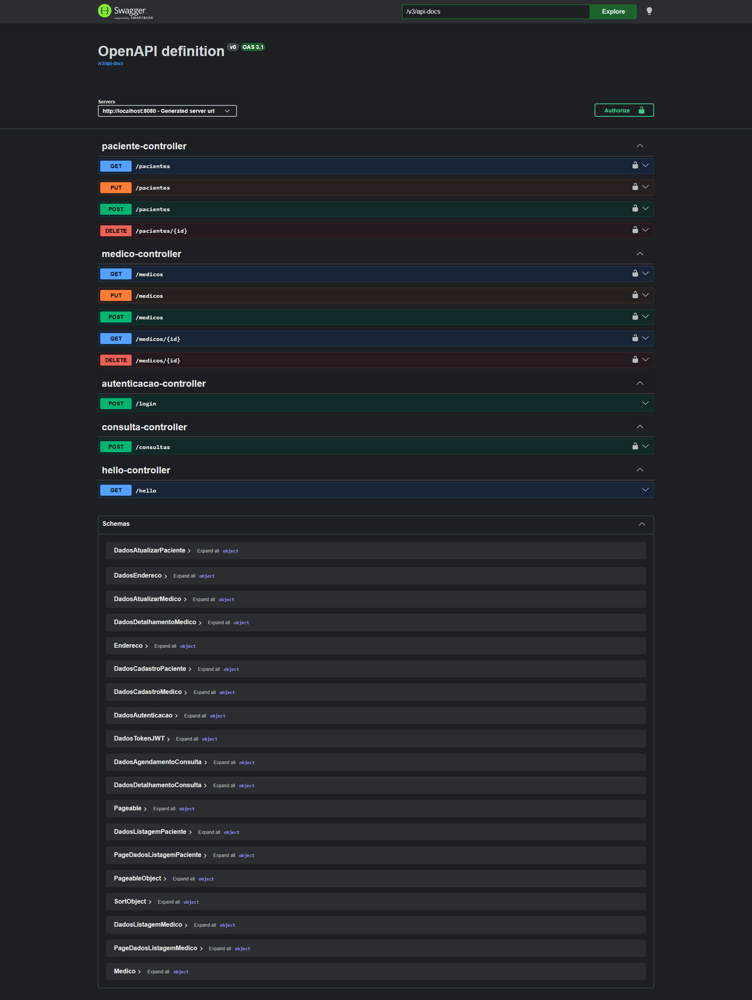
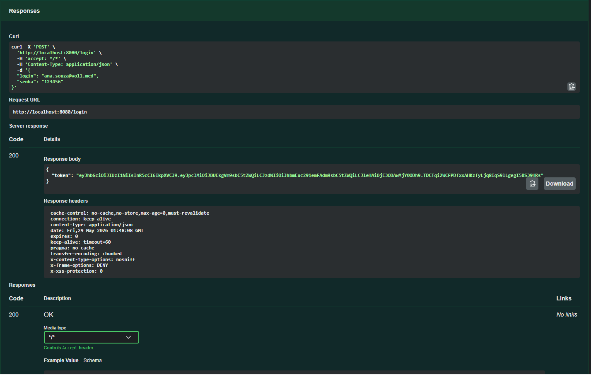

# 📚 API Voll.med (Projeto de exemplo) 

> 🎯 Aplicação REST em Spring Boot para gestão básica de médicos, pacientes e agendamento de consultas. Inclui autenticação JWT e migrações com Flyway.

---

## ✨ Sumário
- 📌 Descrição
- 🛠️ Tecnologias
- 📋 Pré-requisitos
- 🚀 Como rodar (instalação & execução)
- 🎮 Uso / Endpoints principais
- 📸 Screenshots
- 📁 Estrutura de diretórios
- 🔧 Desenvolvimento
- 📚 Recursos
- ❓ FAQ

---

## 📌 Descrição
Aplicação back-end construída com Spring Boot que expõe endpoints REST para gerenciar `medicos`, `pacientes` e `consultas`. Possui:
- Autenticação via JWT (`java-jwt`) — veja `src/main/java/med/voll/api/infra/security/TokenService.java`
- Persistência com Spring Data JPA e MySQL
- Migrações automáticas com Flyway (`src/main/resources/db/migration/`)
- Documentação OpenAPI/Swagger via `springdoc-openapi` (UI incluída)

A aplicação foi estruturada como um projeto Java 17 (ver `pom.xml`) e contém exemplos de controllers como:
- `src/main/java/med/voll/api/controller/HelloController.java` — endpoint de exemplo `/hello`
- `src/main/java/med/voll/api/controller/AutenticacaoController.java` — endpoint `/login`
- `src/main/java/med/voll/api/controller/MedicoController.java`, `PacienteController.java`, `ConsultaController.java`

---

## 🛠️ Tecnologias utilizadas

| Ícone | Tecnologia | Uso |
|:---:|:---:|---|
| ☕ | Java 17 | Linguagem |
| 🌱 | Spring Boot 3.x | Framework principal |
| 🗄️ | MySQL | Banco de dados (runtime) |
| 🐦 | Flyway | Migrações de banco (`src/main/resources/db/migration/`) |
| 🔐 | Spring Security + java-jwt | Autenticação JWT |
| 📄 | Spring Data JPA | Repositórios/ORM |
| 🧪 | JUnit / Spring Boot Test | Testes (dependência em `pom.xml`) |
| 🧰 | Maven (mvnw) | Build / gerenciador de dependências |
| 🖼️ | springdoc-openapi | Documentação e Swagger UI |

(Ver dependências completas em `pom.xml`.)

---

## 📋 Pré-requisitos

- Java 17 instalado e configurado no PATH
- Maven (opcional se usar `mvnw`)
- MySQL rodando localmente (ou container) com um banco disponível
- Variáveis de ambiente/credenciais conforme abaixo

Arquivo de configuração principal: `src/main/resources/application.properties`

Propriedades importantes:
- `spring.datasource.url` — URL do banco (ex.: `jdbc:mysql://localhost/medvoll_api`)
- `spring.datasource.username` / `spring.datasource.password`
- `api.security.token.secret` — secret do JWT (padrão fallback em `application.properties` é `12345678`)

---

## 🚀 Instalação & Execução


Abaixo exemplos para Windows PowerShell (projeto já traz `mvnw.cmd`):

### 1) Ajuste o banco de dados (MySQL)
Crie o banco (exemplo):
```
CREATE DATABASE medvoll_api;
```

### 2) Ajuste credenciais
Credenciais conforme necessário no `src/main/resources/application.properties` ou use variáveis de ambiente.

### 3) Rodar a aplicação em desenvolvimento
```
$env:JWT_SECRET="minha_chave_secreta"
.\mvnw.cmd spring-boot:run
```

### Clonar o projeto

Antes de executar, clone o repositório para a sua máquina. Substitua a URL pelo repositório correto.

Exemplo PowerShell:

```powershell
# Via HTTPS
git clone https://github.com/marcionavarro/alura-java.git

# Ou via SSH
git clone git@github.com:marcionavarro/alura-java.git

# Entrar na pasta do projeto (ajuste o caminho se necessário)
Set-Location -Path .\\03-java-e-spring-boot\api
# ou
cd 03-java-e-spring-boot/api
```

Após clonar, siga os passos acima para configurar e executar a aplicação.

### 4) Gerar o JAR e executar
```
.\mvnw.cmd clean package
$env:JWT_SECRET="minha_chave_secreta"
java -jar .\target\api-0.0.1-SNAPSHOT.jar
```

### 5) Rodar testes
```
.\mvnw.cmd test
```

**Observações:**
- As migrações Flyway localizam-se em `src/main/resources/db/migration/` (arquivos `V1__...`, `V2__...`, etc.) — serão aplicadas automaticamente na inicialização.
- Se preferir, crie um arquivo `.env` e exporte as variáveis antes de rodar.

---

## 🎮 Guia de uso — Endpoints principais

**Observação:** muitos endpoints estão protegidos por JWT. Primeiro faça login para obter o token.

### 1) Autenticação (obter token)
- **Endpoint:** `POST /login`
- **Body (JSON)** conforme `src/main/java/med/voll/api/domain/usuario/DadosAutenticacao.java`:

```json
{
  "login": "usuario@example.com",
  "senha": "senha123"
}
```

- **Resposta:** `{ "token": "eyJ..." }` (structure `DadosTokenJWT`).

Exemplo PowerShell (Invoke-RestMethod):
```powershell
$body = @{ login = "usuario@example.com"; senha = "senha123" } | ConvertTo-Json
$tokenResponse = Invoke-RestMethod -Uri "http://localhost:8080/login" -Method Post -Body $body -ContentType "application/json"
$token = $tokenResponse.token
```

### 2) Usar token (exemplo GET `/medicos`)
```powershell
Invoke-RestMethod -Uri "http://localhost:8080/medicos" -Headers @{ Authorization = "Bearer $token" } -Method Get
```

### 3) Endpoints principais
- `GET /hello` — teste rápido (não exige auth)
- `POST /login` — autenticação (retorna token)
- `POST /medicos` — cadastrar médico (`DadosCadastroMedico`)
- `GET /medicos` — listar médicos ativos (paginação)
- `GET /medicos/{id}` — detalhes do médico
- `PUT /medicos` — atualizar (corpo `DadosAtualizarMedico`)
- `DELETE /medicos/{id}` — desativar médico (soft delete via `ativo=false`)
- `POST /pacientes`, `GET /pacientes`, `PUT /pacientes`, `DELETE /pacientes/{id}` — gerenciamento de pacientes
- `POST /consultas` — agendar consulta (lógica em `AgendaDeConsultas`)

**Documentação OpenAPI/Swagger:**
- UI deve estar disponível em `/swagger-ui.html` ou `/swagger-ui/index.html` (dependendo da versão do springdoc).

---

## 📸 Screenshots

- `docs/screenshots/swagger-ui.png` — Swagger UI / Lista de endpoints


- `docs/screenshots/login-response.png` — Exemplo de resposta do login (token)



---

## 📁 Estrutura de diretórios (explicada)
Raiz do projeto `api/` (resumido):

```
api/
├─ pom.xml                          # Gerenciador de dependências e build
├─ mvnw, mvnw.cmd                   # Maven wrapper
├─ src/
│  ├─ main/
│  │  ├─ java/med/voll/api/
│  │  │  ├─ ApiApplication.java     # Classe principal (ponto de entrada)
│  │  │  ├─ controller/             # Controllers REST (Hello, Autenticacao, Medico, Paciente, Consulta)
│  │  │  ├─ domain/                 # Modelos e regras de negócio (medico, paciente, usuario, consulta, endereco)
│  │  │  └─ infra/security/         # TokenService, DadosTokenJWT, configuração de segurança
│  │  └─ resources/
│  │     ├─ application.properties
│  │     └─ db/migration/           # Arquivos Flyway (V1__, V2__, ...)
└─ HELP.md
```

**Arquivos-chave:**
- `pom.xml` — dependências (Spring Boot, Spring Data JPA, Flyway, Security, java-jwt, springdoc)
- `ApiApplication.java` — inicialização do Spring Boot
- `TokenService.java` — geração/verificação de JWT (`api.security.token.secret` em `application.properties`)
- `src/main/resources/db/migration/` — scripts SQL de migração

---

## 🔧 Desenvolvimento

- Habilite "annotation processing" no IDE para o Lombok (opcional). Lombok está marcado como `optional` no `pom.xml`.
- Para rodar em modo dev com live-reload (DevTools):

```powershell
# DevTools entra automaticamente se detectadas mudanças; use spring-boot:run
.\mvnw.cmd spring-boot:run
```

- Rodar testes:

```powershell
.\mvnw.cmd test
```

**Dicas:**
- Se for usar IDE (IntelliJ/VSCode), importe o projeto como Maven project.
- Para trabalhar com JWT, ver `src/main/java/med/voll/api/infra/security/TokenService.java` (métodos `gerarToken` e `getSubject`).
- As migrações Flyway já estão no diretório `src/main/resources/db/migration/` (V1..V6). Se alterar, incremente a versão Vn__novo.sql.

---

## 📚 Recursos úteis
- Spring Boot: https://spring.io/projects/spring-boot
- Spring Data JPA: https://spring.io/projects/spring-data-jpa
- Spring Security: https://spring.io/projects/spring-security
- JWT (auth0/java-jwt): https://github.com/auth0/java-jwt
- Flyway: https://flywaydb.org/
- Springdoc OpenAPI: https://springdoc.org/
- Arquivos de migração: `src/main/resources/db/migration/`

Também há um `HELP.md` com referências rápidas dentro do projeto.

---