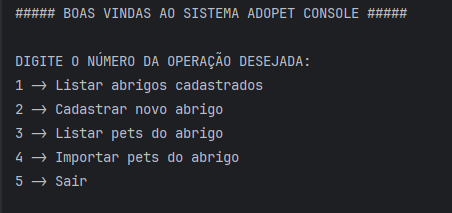
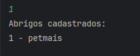
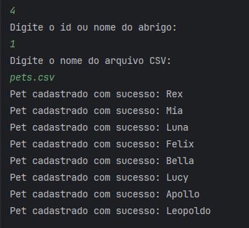
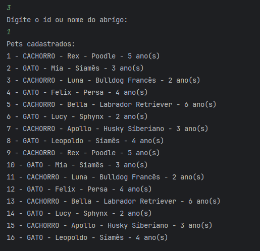
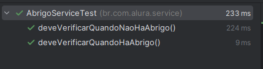

# 🐾 Adopet Console — Aplicação Console para Adoção de Pets

Um pequeno aplicativo console em Java para gerenciar abrigos e pets (importar, listar e cadastrar), desenvolvido como exercício das boas práticas em Java.

---

## ✅ Sumário
- 📌 [Sobre](#-sobre)
- 🎯 [Descrição Detalhada](#-descrição-detalhada-da-aplicação)
- 🎓 [O que Aprendemos](#-o-que-aprendemos-neste-projeto)
- 🛠️ [Tecnologias](#️-tecnologias-utilizadas)
- 📋 [Pré-requisitos & Dependências](#-pré-requisitos--dependências)
- 🚀 [Como Clonar, Compilar e Rodar](#-instruções-passo-a-passo-para-clonar-compilar-e-rodar)
- 🧪 [Testes](#-testes)
- 📸 [Screenshots](#-screenshots)
- 📁 [Estrutura de Diretórios](#-estrutura-de-diretórios-explicada)
- 📚 [Recursos e Links Úteis](#-recursos-e-links-úteis)

---

## 📌 Sobre
Aplicação console (linha de comando) chamada Adopet — exemplo educativo que demonstra:
- modelagem de domínio (`Pet`, `Abrigo`, `TipoPet`),
- leitura de CSV (`pets.csv`),
- consumo/configuração de APIs HTTP (`client/ClientHttpConfiguration.java`),
- organização em comandos (`Command`, `CommandExecutor`, `CadastrarAbrigoCommand`, etc.),
- testes unitários (`AbrigoServiceTest`).

Arquivos principais:
- `pom.xml` — gerenciador de dependências (Maven) e configurações.
- `pets.csv` — amostra de dados.
- `api.jar` — (arquivo presente no repositório; ver uso no projeto, se aplicável).
- Entry point: `src/main/java/br/com/alura/AdopetConsoleApplication.java`.

---

## 🎯 Descrição detalhada da aplicação
Adopet é uma aplicação console que permite:
- Cadastrar abrigos;
- Listar abrigos;
- Importar pets de um abrigo a partir de CSV/JSON;
- Listar pets por abrigo.

Fluxo típico:
1. Executar a aplicação console.
2. Escolher um comando (ex.: listar abrigos, cadastrar abrigo, importar pets).
3. Aplicação interage com serviços (`AbrigoService`, `PetService`) que encapsulam regras de negócio e camadas de persistência/simulação.

Objetivo do projeto: demonstrar boas práticas de organização de código, separação de responsabilidades, testes automatizados e uso de bibliotecas comuns em Java.

---

## 🎓 O que aprendemos neste projeto
- 🎯 Modelagem de domínio e separação de camadas (domain / service / client / command).
- 🧩 Como estruturar uma aplicação console com comandos reaproveitáveis.
- 🧪 Escrita de testes unitários com JUnit 5 e Mockito.
- 🛠️ Configuração e uso de bibliotecas de serialização (Gson, Jackson).
- 📂 Leitura e processamento de CSV/entrada de dados.
- 📐 Boas práticas de design: injeção de dependência simples, responsabilidades únicas e organização de pacotes.

---

## 🛠️ Tecnologias utilizadas

| ⚙️ Tecnologia | ✨ Finalidade | 🔢 Versão |
|---|---:|:--:|
| Java | Linguagem | 17 |
| Maven | Build e gerenciamento de dependências | — |
| Gson | Serialização/Deserialização JSON | 2.10.1 |
| Jackson Databind | Serialização/Deserialização JSON | 2.15.0 |
| JUnit Jupiter | Testes unitários | 5.10.0 |
| Mockito | Mocking em testes | 5.4.0 |

> Observação: as dependências estão declaradas em `pom.xml`.

---

## 📋 Pré-requisitos & Dependências
Antes de rodar a aplicação, certifique-se de ter instalado:
- **Java 17 JDK**
- **Maven**
- **Git** (para clonar o repositório)

Comandos para verificar (PowerShell):

```powershell
java -version
mvn -v
git --version
```

Se as versões estiverem corretas você verá saída correspondente (Java 17, Maven, Git).

---

## 🚀 Instruções passo a passo para clonar, compilar e rodar

### 1. Clonar o repositório
```powershell
git clone https://github.com/marcionavarro/alura-java
cd 04-boas-praticas-em-java/boas-praticas-java
```

### 2. Compilar e empacotar com Maven
```powershell
mvn clean package
```

Isto irá gerar o JAR em `target/adopet-console-1.0-SNAPSHOT.jar` (conforme `pom.xml` e build gerado no workspace).

### 3. Rodar a API (console)
```powershell
java -jar api.jar
```
### 4. Rodar a aplicação (console)
```powershell
java -jar target\adopet-console-1.0-SNAPSHOT.jar
```

### 5. Rodar os testes
```powershell
mvn test
```

### Observações:
- Se preferir rodar direto da IDE (IntelliJ / Eclipse), importe o projeto Maven (`pom.xml`) e execute a classe `br.com.alura.AdopetConsoleApplication`.
- Caso o projeto dependa de `api.jar` (presente na raiz), verifique se há instruções no código que referenciem esse JAR; se necessário, adicione-o ao classpath local ou ao repositório Maven local.

---

## 🧪 Testes
- Testes localizados em `src/test/java/br/com/alura/service/AbrigoServiceTest.java`.
- Execute `mvn test` para rodar o suite de testes.
- Mocking com Mockito para isolar dependências nas unidades de serviço.

**Exemplo de execução dos testes:**
```powershell
mvn clean test
```

Saída esperada:
```
[INFO] Tests run: X, Failures: 0, Errors: 0, Skipped: 0
[INFO] BUILD SUCCESS
```

---

## 📸 Screenshots

### Console Principal


### Listar Abrigos


### Resultado de Importação


### Listar Pets cadastrados no Abrigo


### Tests Verificados


---

## 📁 Estrutura de diretórios (explicada)

Raiz do projeto (trecho relevante):

```
boas-praticas-java/
├── pom.xml                          # Configuração Maven (dependências, versão Java)
├── api.jar                          # JAR auxiliar incluído no repositório
├── pets.csv                         # Arquivo com dados de exemplo de pets
├── README.md                        # Este arquivo
├── refer.txt                        # Referências do projeto
├── src/
│   ├── main/java/br/com/alura/
│   │   ├── AdopetConsoleApplication.java     # Ponto de entrada (main)
│   │   ├── Command.java                      # Interface abstrata de comandos
│   │   ├── CommandExecutor.java              # Gerenciador de execução de comandos
│   │   ├── CadastrarAbrigoCommand.java       # Comando: cadastrar abrigo
│   │   ├── ListarAbrigoCommand.java          # Comando: listar abrigos
│   │   ├── ImportarPetsDoAbrigoCommand.java  # Comando: importar pets do abrigo
│   │   ├── ListarPetsDoAbrigoCommand.java    # Comando: listar pets de um abrigo
│   │   ├── client/
│   │   │   └── ClientHttpConfiguration.java  # Configuração/encapsulamento do client HTTP
│   │   ├── domain/                           # Modelos de domínio (POJOs)
│   │   │   ├── Abrigo.java                   # Entidade: abrigo
│   │   │   ├── Pet.java                      # Entidade: pet
│   │   │   └── TipoPet.java                  # Enum: tipo de pet
│   │   └── service/                          # Serviços com regras de negócio
│   │       ├── AbrigoService.java            # Lógica de abrigos
│   │       └── PetService.java               # Lógica de pets
│   └── test/java/br/com/alura/service/
│       └── AbrigoServiceTest.java            # Testes unitários para AbrigoService
├── target/                          # Pasta gerada pelo Maven (compilados e JARs)
│   ├── adopet-console-1.0-SNAPSHOT.jar      # JAR executável principal
│   └── classes/                     # Arquivos .class compilados
└── ...
```

### Breve explicação de responsabilidades:
- **domain/** — Modelos (POJOs) e enums que representam entidades do negócio.
- **service/** — Lógica de negócio e operações que manipulam os modelos.
- **client/** — Envoltória para chamadas externas (HTTP/REST) ou configuração.
- **Comandos** — Classes que interpretam entrada do usuário e chamam os serviços correspondentes.
- **AdopetConsoleApplication** — Inicializa a aplicação e o loop de console interativo.

---

## 📚 Recursos e links úteis
- **Java OpenJDK / Oracle**: https://www.oracle.com/java/technologies/javase/jdk17-archive-downloads.html
- **Maven**: https://maven.apache.org/
- **Gson**: https://github.com/google/gson
- **Jackson Databind**: https://github.com/FasterXML/jackson-databind
- **JUnit 5**: https://junit.org/junit5/
- **Mockito**: https://site.mockito.org/
- **CSV handling em Java**: https://www.baeldung.com/java-csv
- **Boas práticas Java**: https://www.baeldung.com/
