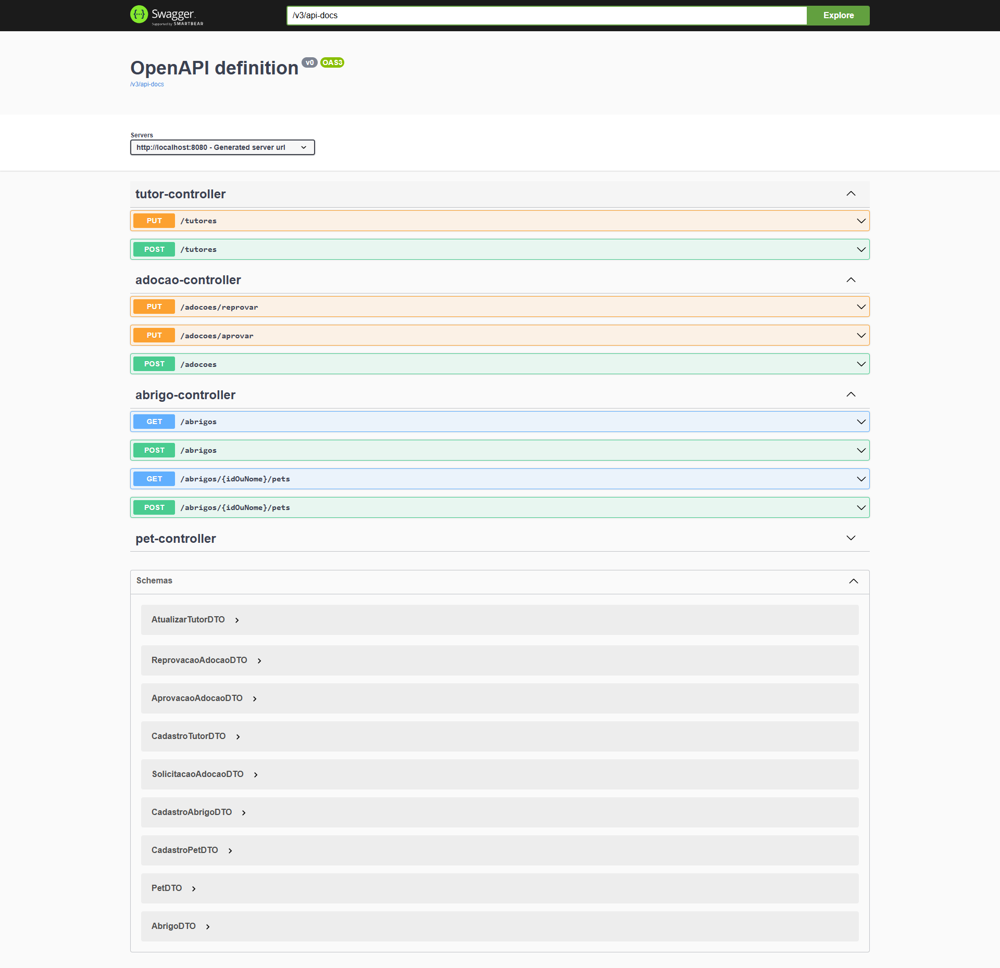
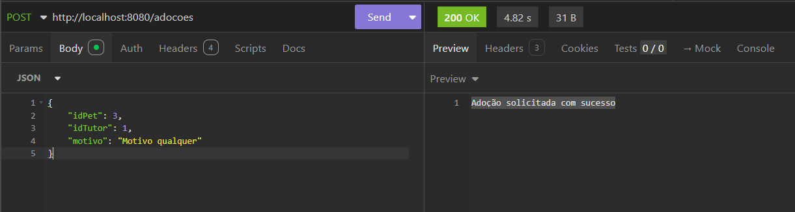

# 🐾 Adopet API

> Uma API REST robusta para gerenciamento de adoção de pets, desenvolvida com as melhores práticas de programação Java e testes automatizados.

---

## 💻 Sobre o Projeto

**Adopet** é uma API REST desenvolvida em Java que gerencia o sistema completo de adoção de pets. O projeto é fictício, criado para fins educacionais, mas simula um cenário real onde tutores podem solicitar adoção, abrigos podem cadastrar pets, e o sistema gerencia todo o fluxo de aprovação.

Este repositório contém apenas a **API Backend**, desenvolvida com **Spring Boot 3** e integrada com banco de dados **MySQL**. O projeto segue padrões de arquitetura moderna, com validações robustas, tratamento de exceções e cobertura abrangente de testes automatizados.

---

## ⚙️ Funcionalidades Principais

- ✅ **Cadastro e atualização de tutores** com validações de documento e limite de adoções
- ✅ **Cadastro de abrigos** para gerenciamento de múltiplas instituições
- ✅ **Cadastro de pets** no abrigo com status de disponibilidade
- ✅ **Listagem de pets disponíveis** para adoção com filtros
- ✅ **Solicitação de adoção** com validações complexas
- ✅ **Aprovação/reprovação de adoção** com probabilidades e regras de negócio
- ✅ **Notificações por email** sobre status de adoção
- ✅ **Migrations automáticas** com Flyway

---

## 🎨 Layout

O projeto desse repositório é apenas a API Backend, mas existe um **Figma com o layout completo** disponível neste link: 

<a href="https://www.figma.com/file/TlfkDoIu8uyjZNla1T8TpH?embed_host=notion&kind=&node-id=518%3A11&t=esSUkfGQEWUeUASj-1&type=design&viewer=1" target="_blank">
  <strong>📋 Visualizar Layout no Figma</strong>
</a>

---

## 🛠️ Tecnologias Utilizadas

| Tecnologia | Versão | Descrição |
|-----------|--------|-----------|
| **Java** | 17 | Linguagem de programação principal |
| **Spring Boot** | 3.1.0 | Framework para desenvolvimento de aplicações Java |
| **Spring Data JPA** | Latest | ORM para persistência de dados |
| **Spring Validation** | Latest | Validações de dados de entrada |
| **Spring Mail** | Latest | Envio de emails para notificações |
| **MySQL** | 8.0+ | Banco de dados relacional |
| **Hibernate** | 6.2+ | Implementação JPA |
| **Flyway** | Latest | Versionamento e migrations de banco de dados |
| **Maven** | 3.8+ | Gerenciador de dependências e build |
| **JUnit 5** | Latest | Framework de testes unitários |
| **Mockito** | Latest | Mock de dependências em testes |
| **Spring Boot Test** | Latest | Testes de integração com Spring |

---

## 📋 Pré-requisitos e Dependências

### Requisitos do Sistema

- **Java Development Kit (JDK)** versão 17 ou superior
- **Maven** versão 3.8 ou superior
- **MySQL Server** versão 8.0 ou superior
- **Git** para clonar o repositório

### Verificar Instalações

```bash
# Verificar Java
java -version

# Verificar Maven
mvn -version

# Verificar MySQL
mysql --version
```

---

## 🚀 Como Executar o Projeto

### 1️⃣ Clonar o Repositório

```bash
git clone https://github.com/marcionavarro/alura-java
cd 05-adobepet-api
```

### 2️⃣ Configurar o Banco de Dados

Crie um banco de dados MySQL para o projeto:

```sql
-- Criar banco de dados
CREATE DATABASE adopet_db CHARACTER SET utf8mb4 COLLATE utf8mb4_unicode_ci;

-- Criar usuário (opcional)
CREATE USER 'adopet_user'@'localhost' IDENTIFIED BY 'sua_senha_segura';
GRANT ALL PRIVILEGES ON adopet_db.* TO 'adopet_user'@'localhost';
FLUSH PRIVILEGES;
```

### 3️⃣ Configurar Variáveis de Ambiente

Edite o arquivo `src/main/resources/application.properties`:

```properties
# Conexão com banco de dados
spring.datasource.url=jdbc:mysql://localhost:3306/adopet_db
spring.datasource.username=adopet_user
spring.datasource.password=sua_senha_segura
spring.datasource.driver-class-name=com.mysql.cj.jdbc.Driver

# Configuração JPA/Hibernate
spring.jpa.hibernate.ddl-auto=validate
spring.jpa.show-sql=false
spring.jpa.properties.hibernate.dialect=org.hibernate.dialect.MySQL8Dialect
spring.jpa.properties.hibernate.format_sql=true

# Flyway (Migrations)
spring.flyway.enabled=true
spring.flyway.locations=classpath:db/migration

# Configuração de email (opcional)
spring.mail.host=seu-smtp-host
spring.mail.port=587
spring.mail.username=seu-email
spring.mail.password=sua-senha
```

### 4️⃣ Instalar Dependências

```bash
mvn clean install
```

### 5️⃣ Executar a Aplicação

**Opção 1: Via Maven**
```bash
mvn spring-boot:run
```

**Opção 2: Via JAR compilado**
```bash
mvn clean package
java -jar target/adopet-api-0.0.1-SNAPSHOT.jar
```

### 6️⃣ Verificar se está Funcionando

A API estará disponível em:
```
http://localhost:8080
```

Acesse o Swagger para documentação interativa:
```
http://localhost:8080/swagger-ui.html
```

---

## 🧪 Executar Testes

### Rodar Todos os Testes

```bash
mvn test
```

### Rodar Testes de Uma Classe Específica

```bash
mvn test -Dtest=NomeDaClasseTest
```

### Rodar Testes com Cobertura

```bash
mvn test jacoco:report
```

### Visualizar Relatório de Testes

Após executar os testes, acesse:
```
target/surefire-reports/
```

---

## 🎓 O Que Aprendemos Neste Projeto

### 🧪 Testes e Qualidade de Código

Este projeto coloca **grande ênfase em testes automatizados** e boas práticas de desenvolvimento:

#### ✅ Testes Unitários
- **Padrão AAA (Arrange, Act, Assert)** para organização clara dos testes
- Testes com **Mockito** para isolamento de dependências
- Cobertura de casos de sucesso e falha
- Validação de lógica de negócio isoladamente

#### ✅ Testes de Integração
- Testes com **@SpringBootTest** para validar contexto completo
- Integração com banco de dados de teste
- Validação de fluxos completos end-to-end
- Teste de controllers com **MockMvc**

#### ✅ Validações de Dados
- **Bean Validation** com anotações `@NotBlank`, `@NotNull`, `@Email`, etc.
- Validações customizadas com interfaces `ValidadorAdocao`
- Tratamento de exceções específicas para cada tipo de erro
- Mensagens de erro descritivas para o cliente

#### ✅ Padrão de Validação
```java
// Exemplo: Validar se tutor tem limite de adoções
public interface ValidadorAdocao {
    void validar(SolicitacaoAdocao dto);
}

// Implementações específicas
- ValidacaoTutorComAdocaoEmAndamento
- ValidacaoTutorComLimiteDeAdocoes
- ValidacaoPetDisponivel
```

#### ✅ Testes Específicos Implementados

| Classe de Teste | Cobertura |
|-----------------|-----------|
| **AbrigoControllerTest** | Endpoints de abrigos (CRUD) |
| **AbrigoServiceTest** | Lógica de negócio de abrigos |
| **AdocaoControllerTest** | Fluxo completo de adoção |
| **AdocaoServiceTest** | Validações e aprovação de adoção |
| **PetControllerTest** | Endpoints de pets |
| **PetServiceTest** | Listagem e filtros de pets |
| **TutorControllerTest** | Endpoints de tutores |
| **TutorServiceTest** | Cadastro e atualização de tutores |
| **CalculadoraProbabilidadeAdocaoTest** | Cálculo de probabilidade |
| **ValidacaoPetComAdocaoEmAndamentoTest** | Validação de pets |
| **ValidacaoTutorComAdocaoEmAndamentoTest** | Validação de adoções em andamento |
| **ValidacaoTutorComLimiteDeAdocoesTest** | Limite de adoções por tutor |

### 📚 Arquitetura e Design Patterns

- **MVC (Model-View-Controller)** com separação clara de responsabilidades
- **DTO (Data Transfer Object)** para comunicação com cliente
- **Repository Pattern** com Spring Data JPA
- **Service Layer** com lógica de negócio centralizada
- **Strategy Pattern** para validações com `ValidadorAdocao`

### 🔐 Segurança e Validações

- Validação de entrada em todos os endpoints
- Tratamento de exceções customizado
- Códigos HTTP apropriados em respostas
- Proteção contra dados nulos e inválidos

### 📊 Persistência de Dados

- **JPA/Hibernate** para ORM
- **Flyway** para versionamento de schema
- Migrations automáticas no startup
- Relacionamentos entre entidades (1:N, N:N)

### 🔄 Integração com Email

- Configuração de SMTP
- Envio de notificações de adoção
- Templates de email dinâmicos

---

## 📁 Estrutura de Diretórios

```
adopet-api/
│
├── src/
│   ├── main/
│   │   ├── java/br/com/alura/adopet/
│   │   │   ├── api/
│   │   │   │   ├── controller/          # 🎮 Endpoints da API REST
│   │   │   │   │   ├── AbrigoController.java
│   │   │   │   │   ├── AdocaoController.java
│   │   │   │   │   ├── PetController.java
│   │   │   │   │   └── TutorController.java
│   │   │   │   │
│   │   │   │   ├── model/               # 📦 Entidades do banco de dados
│   │   │   │   │   ├── Abrigo.java
│   │   │   │   │   ├── Adocao.java
│   │   │   │   │   ├── Pet.java
│   │   │   │   │   └── Tutor.java
│   │   │   │   │
│   │   │   │   ├── service/             # ⚙️ Lógica de negócio
│   │   │   │   │   ├── AbrigoService.java
│   │   │   │   │   ├── AdocaoService.java
│   │   │   │   │   ├── PetService.java
│   │   │   │   │   ├── TutorService.java
│   │   │   │   │   └── CalculadoraProbabilidadeAdocao.java
│   │   │   │   │
│   │   │   │   ├── repository/          # 💾 Acesso a dados
│   │   │   │   │   ├── AbrigoRepository.java
│   │   │   │   │   ├── AdocaoRepository.java
│   │   │   │   │   ├── PetRepository.java
│   │   │   │   │   └── TutorRepository.java
│   │   │   │   │
│   │   │   │   ├── dto/                 # 📨 Transfer Objects
│   │   │   │   │   ├── AbrigoDto.java
│   │   │   │   │   ├── AdocaoDto.java
│   │   │   │   │   ├── PetDto.java
│   │   │   │   │   ├── SolicitacaoAdocaoDto.java
│   │   │   │   │   ├── AprovacaoAdocaoDto.java
│   │   │   │   │   └── TutorDto.java
│   │   │   │   │
│   │   │   │   ├── validate/            # ✅ Validadores de negócio
│   │   │   │   │   ├── ValidadorAdocao.java (interface)
│   │   │   │   │   ├── ValidacaoPetComAdocaoEmAndamento.java
│   │   │   │   │   ├── ValidacaoPetDisponivel.java
│   │   │   │   │   ├── ValidacaoTutorComAdocaoEmAndamento.java
│   │   │   │   │   └── ValidacaoTutorComLimiteDeAdocoes.java
│   │   │   │   │
│   │   │   │   └── exception/           # ⚠️ Exceções customizadas
│   │   │   │       └── ValidacaoException.java
│   │   │   │
│   │   │   └── AdopetApiApplication.java # 🚀 Classe principal
│   │   │
│   │   └── resources/
│   │       ├── application.properties    # ⚙️ Configurações
│   │       └── db/
│   │           └── migration/            # 📜 Scripts Flyway
│   │               ├── V1__create-table-abrigos.sql
│   │               ├── V2__create-table-tutores.sql
│   │               ├── V3__create-table-pets.sql
│   │               └── V4__create-table-adocoes.sql
│   │
│   └── test/
│       └── java/br/com/alura/adopet/
│           ├── AdopetApiApplicationTests.java
│           └── api/
│               ├── controller/           # 🧪 Testes de Controller
│               │   ├── AbrigoControllerTest.java
│               │   ├── AdocaoControllerTest.java
│               │   ├── PetControllerTest.java
│               │   └── TutorControllerTest.java
│               │
│               ├── service/              # 🧪 Testes de Service
│               │   ├── AbrigoServiceTest.java
│               │   ├── AdocaoServiceTest.java
│               │   ├── PetServiceTest.java
│               │   ├── TutorServiceTest.java
│               │   └── CalculadoraProbabilidadeAdocaoTest.java
│               │
│               └── validate/             # 🧪 Testes de Validação
│                   ├── ValidacaoPetComAdocaoEmAndamentoTest.java
│                   ├── ValidacaoPetDIsponivelTest.java
│                   ├── ValidacaoTutorComAdocaoEmAndamentoTest.java
│                   └── ValidacaoTutorComLimiteDeAdocoesTest.java
│
├── target/                               # 🔨 Artefatos compilados
├── pom.xml                               # 📋 Configuração Maven
├── mvnw / mvnw.cmd                       # 🎯 Maven Wrapper
├── Adopet-testes.postman_collection.json # 📬 Coleção Postman
└── README.md                             # 📖 Este arquivo
```

---

## 📸 Screenshots e Exemplos

### Swagger-UI


### Exemplo de Requisição - Solicitar Adoção




### Teste na IDE


Importe a coleção disponível:
```
Adopet-testes.postman_collection.json
```

---

## 📚 Recursos e Links Úteis

### Documentação Oficial

- 🔗 [Java 17 Documentation](https://docs.oracle.com/en/java/javase/17/)
- 🔗 [Spring Boot Official Docs](https://spring.io/projects/spring-boot)
- 🔗 [Spring Data JPA Reference](https://spring.io/projects/spring-data-jpa)
- 🔗 [Hibernate ORM](https://hibernate.org/orm/)
- 🔗 [Flyway Database Migrations](https://flywaydb.org/documentation/)
- 🔗 [MySQL Documentation](https://dev.mysql.com/doc/)

### Testes e Qualidade

- 🔗 [JUnit 5 User Guide](https://junit.org/junit5/docs/current/user-guide/)
- 🔗 [Mockito Documentation](https://javadoc.io/doc/org.mockito/mockito-core/latest/org/mockito/Mockito.html)
- 🔗 [Spring Boot Testing](https://spring.io/guides/gs/testing-web/)
- 🔗 [Jakarta Bean Validation](https://beanvalidation.org/documentation/)

### Padrões e Best Practices

- 🔗 [RESTful API Best Practices](https://restfulapi.net/)
- 🔗 [Design Patterns in Java](https://www.oracle.com/java/technologies/)
- 🔗 [Clean Code Principles](https://clean-code-java.com/)

---

## 👨‍🏫 Sobre o Projeto Educacional

Este projeto foi desenvolvido por **[Alura](https://www.alura.com.br)** e é utilizado nos cursos de **Boas Práticas de Programação com Java**, focando em:

- ✨ Desenvolvimento profissional
- 🧪 Testes automatizados robustos
- 🏗️ Arquitetura bem definida
- 📚 Padrões de design
- 🔐 Segurança e validações

**Instrutor:** [Rodrigo Ferreira](https://cursos.alura.com.br/user/rodrigo-ferreira)

---

## 📄 Licença

Este projeto foi desenvolvido para fins educacionais e segue a licença de conteúdo da **Alura**.

### Desenvolvido com ❤️ para aprender Java e testes automatizados

**[⬆ Voltar ao topo](#-adopet-api)**
